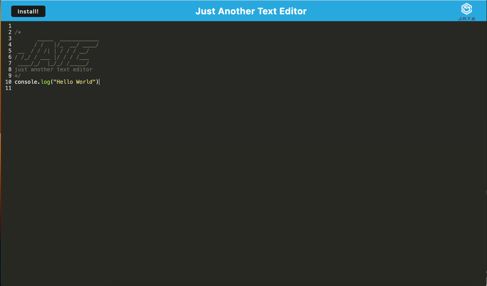

# Text-Editor

URL to deployed application: https://text-editor-pwa-ch19-319abd96543c.herokuapp.com/ 

# Description

This is a browser text editor that works as a Progressive Web App (PWA). It keeps your data safe, even if your browser support is limited, and it also works offline.

# Usage

To use this application, please:

1. Access the deployed website through your web browser to launch the text editor application.
2. Begin entering your content or code snippets into the text editor.
3. As you type, the application will perform automatic content-saving.
4. If you happen to close the text editor and later reopen it, your previously entered content will be seamlessly restored.
5. For offline convenience, simply click the "Install" button to install the application on your computer.
6. Once installed, you can utilize the text editor even when you're offline.

# Credits

* I employed a starter codebase created by the bootcamp as the project's foundation. I then extended and enhanced this initial code to integrate additional features and functionalities.

* I utilzed code snippets from activities found in Module 19.
